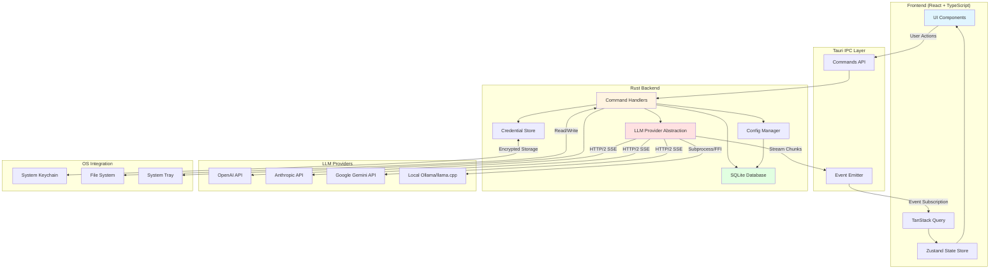

# ARTIFACT 1: ARCHITECTURE.md

## Solution Overview
A desktop-native application built with Tauri (Rust backend + web frontend) providing a local-first, privacy-focused LLM interaction environment. The architecture prioritizes zero-latency UI, offline capability, and secure credential management while supporting multiple LLM providers through a unified abstraction layer.

## Technology Choices

**Core Framework: Tauri v2**
- Rust backend provides memory safety, performance, and cross-platform compilation
- Web frontend (React + TypeScript) enables rapid UI development with rich component ecosystems
- 600KB binary overhead vs 150MB+ Electron makes distribution feasible
- Native OS integration for file system access, tray icons, and system notifications

**LLM Integration: Custom Rust Provider Abstraction**
- Unified async trait for OpenAI, Anthropic, Google, local models (Ollama/llama.cpp)
- HTTP/2 streaming via reqwest for SSE responses
- Local model support through FFI bindings or subprocess management
- No MCP needed—direct HTTP client interaction is simpler and faster

**State Management**
- Frontend: Zustand (lightweight React state) + TanStack Query for async data
- Backend: In-memory state with SQLite persistence (conversations, settings, API keys)
- Encrypted credential storage using OS keychain (Windows Credential Manager, macOS Keychain, Linux Secret Service)

**Data Flow**
Frontend → Tauri IPC → Rust command handlers → LLM provider abstraction → HTTP API / Local process → Stream responses via Tauri events → Frontend updates

## Deployment Target
Single-binary executables for Windows (x64), macOS (Intel + Apple Silicon), Linux (x64, AppImage). Auto-updates via Tauri's built-in updater with GitHub Releases.

## Human-Assistance Requirements
- API keys from users for cloud LLM providers (OpenAI, Anthropic, etc.)
- Code signing certificates for macOS notarization and Windows SmartScreen bypass
- CI/CD configuration for cross-platform builds (GitHub Actions with platform-specific runners)

## Architecture Diagram

