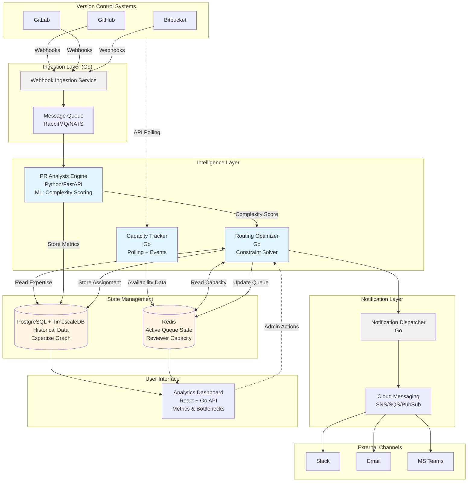

# ARTIFACT 1: ARCHITECTURE.md

## Solution Overview
An intelligent code review coordination platform that ingests pull requests from version control systems, analyzes their complexity and risk, tracks reviewer capacity in real-time, and automatically routes reviews to optimize throughput. The system operates as a webhook-driven event processor with ML-based routing intelligence.

## Technology Choices & Rationale

**Core Platform:** Go-based microservices on Kubernetes
- Justification: High-throughput event processing, excellent concurrency for webhook handling, mature GitHub/GitLab client libraries, efficient resource usage for continuous background jobs

**ML Routing Engine:** Python (FastAPI) with scikit-learn/XGBoost
- Justification: PR complexity scoring requires ML (lines changed, file types, historical merge time, author experience, test coverage delta). Python ecosystem excels here. Isolated as separate service to enable independent scaling and model updates.

**Real-time State:** Redis with persistence
- Justification: Sub-second lookups for reviewer capacity, active PR queue state, routing decisions. TTL-based cache invalidation for stale data.

**Historical Analytics:** PostgreSQL with TimescaleDB extension
- Justification: Time-series queries for capacity forecasting, team performance trends, SLA tracking. Strong ACID guarantees for audit trails.

**Integration Layer:** REST + Webhooks for GitHub/GitLab/Bitbucket APIs
- Justification: Universal compatibility. No proprietary VCS lock-in.

**Notification System:** AWS SNS/SQS or equivalent (cloud-agnostic via Pulumi)
- Justification: Reliable delivery to Slack, email, MS Teams with retry logic.

**Deployment Target:** Kubernetes (cloud-agnostic, tested on EKS/GKE/AKS)
- Justification: Auto-scaling for PR volume spikes, zero-downtime deployments, multi-region DR.

## Major Components

1. **Webhook Ingestion Service (Go):** Receives PR events, validates signatures, enqueues for processing
2. **PR Analysis Engine (Python):** Extracts metrics (complexity, risk score, estimated review time)
3. **Routing Optimizer (Go):** Matches PRs to reviewers using capacity data, expertise graphs, and ML scores
4. **Capacity Tracker (Go):** Monitors reviewer activity via API polling and webhook events (PR comments, reviews started)
5. **Notification Dispatcher (Go):** Sends context-rich review requests to assigned reviewers
6. **Analytics Dashboard (React + Go backend):** Real-time metrics, bottleneck identification, team health

## Data Flows

1. **Ingest:** VCS webhook → Ingestion Service → Message Queue → Analysis Engine
2. **Route:** Analysis complete → Routing Optimizer (queries Redis for capacity, PostgreSQL for expertise) → Assignment stored in Redis + PostgreSQL
3. **Notify:** Assignment → Dispatcher → SNS/SQS → Slack/Email
4. **Feedback Loop:** Review completion event → Capacity Tracker updates availability → Triggers next routing cycle

## Known Constraints & Human Dependencies

- **API Keys Required:** GitHub/GitLab tokens, Slack webhook URLs, AWS credentials (or equivalent cloud provider)
- **ML Model Training:** Initial historical PR data dump (6+ months) needed to train complexity model. Requires data science review for baseline accuracy.
- **Expertise Graph Bootstrapping:** Requires either CODEOWNERS file parsing or 90-day commit history analysis to map reviewer competencies
- **Slack App Approval:** Enterprise Slack instances require IT approval for bot installation
- **Paid Services:** Cloud hosting costs ($500-2000/month for 100-engineer team), VCS API rate limits may require paid tier for large orgs

## Scalability & Maintenance

- Handles 10,000 PRs/day per cluster with horizontal pod autoscaling
- Model retraining pipeline runs weekly via scheduled jobs
- Stateless services enable blue-green deployments
- Observability via OpenTelemetry (Prometheus + Grafana)

## Architecture Diagram

