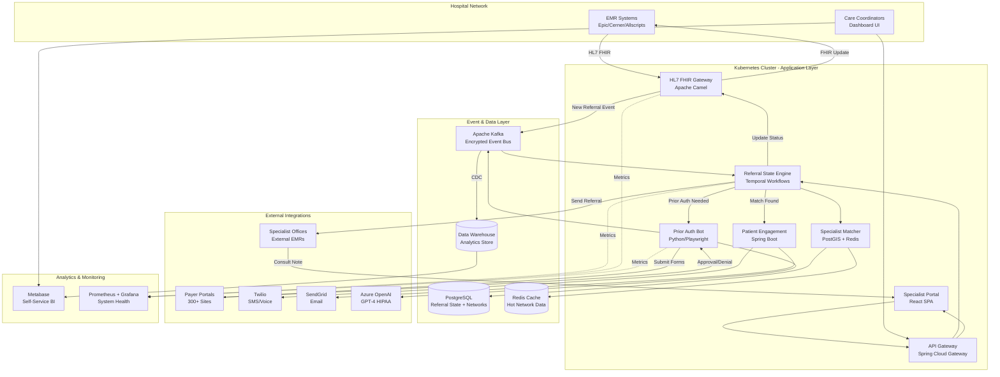

# ARTIFACT 1: ARCHITECTURE.md

## Solution Overview
A HIPAA-compliant, event-driven referral orchestration platform that automates the complete referral lifecycle from order creation to specialist consultation note receipt. The system integrates with existing EMR/EHR systems via HL7 FHIR APIs, manages multi-party communication workflows, handles prior authorization submissions, and provides real-time tracking dashboards.

## Technology Choices & Rationale

**Core Runtime: Java/Spring Boot on Kubernetes**
- Healthcare requires enterprise-grade reliability, audit trails, and vendor support
- Spring Boot ecosystem provides mature HIPAA-compliant libraries (Spring Security, Spring Integration for HL7)
- Kubernetes enables multi-tenancy isolation required for health systems with strict data sovereignty requirements

**Integration Layer: Apache Camel with FHIR connectors**
- Healthcare integration demands handling HL7 v2, HL7 FHIR, X12, and legacy fax protocols simultaneously
- Camel provides battle-tested healthcare adapters and extensive connectivity patterns
- Supports both synchronous API calls and asynchronous message queuing for unreliable clinical systems

**Event Bus: Apache Kafka with encryption-at-rest**
- Referral workflows involve 8-15 distinct state transitions requiring reliable event ordering
- Kafka provides audit log immutability required for HIPAA compliance
- Enables replay capability for reconciliation when external systems (payers, EMRs) fail mid-process

**Prior Authorization Engine: Python/FastAPI microservice**
- Payer portal automation requires dynamic web scraping and form-filling (Playwright/Selenium)
- LLM integration (GPT-4 via Azure OpenAI) to extract clinical justification from referral notes and map to payer-specific forms
- Separate deployment boundary isolates credential management for 300+ payer portals

**Patient Engagement: Twilio + SendGrid with templating engine**
- Multi-channel communication (SMS, email, voice) via proven HIPAA-BAA vendors
- Dynamic appointment reminder scheduling based on specialty-specific lead times
- Two-way messaging for appointment confirmation with HIPAA-compliant message retention

**Specialist Matching: PostgreSQL with PostGIS + Redis cache**
- Geospatial queries for distance-based specialist matching
- Insurance network eligibility requires complex joins across payer contracts, provider directories, and patient coverage
- Redis caches frequently-accessed network data to meet <500ms matching SLA

**State Machine Orchestration: Temporal.io**
- Referral workflows span days/weeks with long-running state (waiting for auth approval, specialist availability)
- Temporal provides durable execution guarantees with automatic retries for transient EMR/payer API failures
- Workflow versioning allows gradual rollout of process improvements without breaking in-flight referrals

**Dashboard & Analytics: React SPA + Metabase**
- Real-time referral tracking requires responsive UI with live updates (WebSocket via Spring)
- Metabase provides self-service analytics for health system administrators without custom development
- Embedded dashboards support white-labeled deployment for multi-tenant scenarios

## Major Components

1. **HL7/FHIR Gateway**: Bidirectional sync with EMR systems (Epic, Cerner, Allscripts)
2. **Referral State Engine**: Temporal workflows managing 12-state referral lifecycle
3. **Specialist Directory Service**: Maintains real-time provider availability, insurance networks, specialty taxonomies
4. **Prior Auth Automation**: AI-powered form extraction and payer portal submission
5. **Patient Engagement Hub**: Omnichannel communication with consent management
6. **Specialist Portal**: Lightweight web interface for non-EMR-integrated practices to receive/acknowledge referrals
7. **Analytics & Reporting**: HIPAA-compliant data warehouse with leakage funnel analysis

## Data Flows

**Inbound Referral**: EMR → HL7 FHIR Gateway → Kafka → Referral State Engine → Specialist Matching → Patient Engagement
**Prior Auth**: State Engine → Auth Microservice → Payer Portal (RPA) → Response Webhook → State Engine → EMR Update
**Specialist Response**: Specialist Portal → API Gateway → State Engine → EMR FHIR Update → Care Team Notification
**Analytics**: All Kafka events → Change Data Capture → Data Warehouse → Metabase dashboards

## Deployment Target

**Primary**: AWS GovCloud or Azure Government Cloud
- HIPAA compliance requires BAA with cloud provider
- Multi-region active-active for disaster recovery (RTO <15 min, RPO <5 min)
- Separate VPCs per health system tenant with AWS PrivateLink for EMR connectivity

**Edge Deployment**: Hospital on-premises Kubernetes clusters for zero-latency EMR integration at top 50 health systems (hybrid cloud model)

## Known Constraints

**Human Assistance Required**:
- EMR integration credentials/VPN setup (3-6 months sales cycle per health system)
- Payer portal credentials for prior auth automation (requires provider enrollment)
- Twilio HIPAA BAA setup + phone number provisioning per health system
- Azure OpenAI HIPAA-compliant endpoint provisioning
- State-specific telehealth licensing requirements for cross-state referrals
- Clinical validation of specialty matching algorithms (requires physician advisory board)
- HIPAA security risk assessment and penetration testing (required annually)
- Business Associate Agreements with all subprocessors (Twilio, SendGrid, cloud providers)

**Paid Services**:
- Azure OpenAI API ($0.01/1K tokens, estimated $8K/month for 100K referrals)
- Twilio SMS ($0.0079/message, estimated $15K/month)
- AWS infrastructure (~$45K/month for production + DR environments at scale)
- Temporal Cloud ($2K/month) or self-hosted cluster management
- HL7 FHIR connector licenses if using proprietary adapters like Rhapsody ($50K-200K/year)

**Proprietary Data**:
- Insurance payer network directories (Blue Cross, UHC, Aetna) require licensing agreements
- Specialist provider directories updated via periodic NPPES/PECOS data feeds
- CPT/ICD-10 code mappings for prior auth clinical justification

## Architecture Diagram

