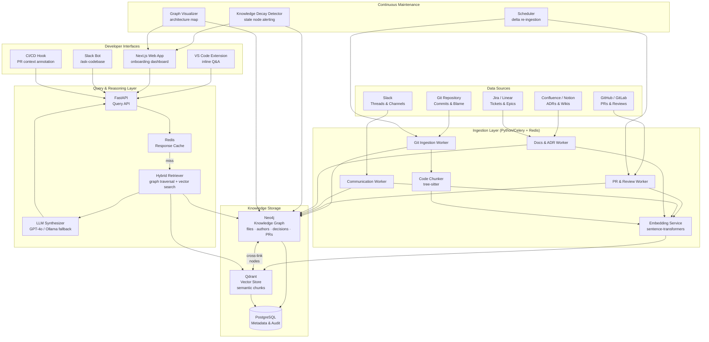

# ARTIFACT 1: ARCHITECTURE.md

## Codebase Knowledge Intelligence Platform

### Solution Overview
A continuously-updated, AI-powered knowledge graph that mines git history, PRs, code comments, Slack threads, and architectural decision records (ADRs) to build a queryable, living intelligence layer over any codebase. Developers ask natural-language questions; the system retrieves contextually-grounded answers tied to specific files, commits, and decisions.

### Technology Choices & Rationale
- **Ingestion Workers (Python/asyncio):** Native git, GitHub/GitLab, and Slack API support; rich NLP ecosystem.
- **Graph Database (Neo4j):** Captures relationships between files, authors, decisions, PRs, and concepts that flat vector stores cannot — critical for architectural reasoning.
- **Vector Store (Qdrant):** Semantic similarity search over code chunks and documentation; complements Neo4j for hybrid retrieval.
- **LLM Layer (OpenAI GPT-4o / local Ollama fallback):** Synthesizes retrieved context into coherent explanations; RAG architecture prevents hallucination.
- **Embedding Pipeline (sentence-transformers + tree-sitter):** Language-agnostic code chunking with semantic boundaries.
- **API Layer (FastAPI):** Async, typed, easily extensible.
- **Frontend (Next.js + VS Code Extension):** Meets developers where they work.
- **Task Queue (Celery + Redis):** Manages continuous re-ingestion without blocking queries.
- **Deployment:** Kubernetes-compatible Docker Compose; self-hostable for enterprise data residency requirements.

### Known Constraints & Human Assistance Required
- **API Keys Needed:** OpenAI API, GitHub/GitLab OAuth apps, Slack app credentials.
- **Proprietary integrations:** Confluence, Jira, Linear require per-instance OAuth setup.
- **LLM cost management:** Production deployments need rate-limit budgeting.
- **Cold start:** Initial full-repo ingestion may take hours for large monorepos.

## Architecture Diagram

