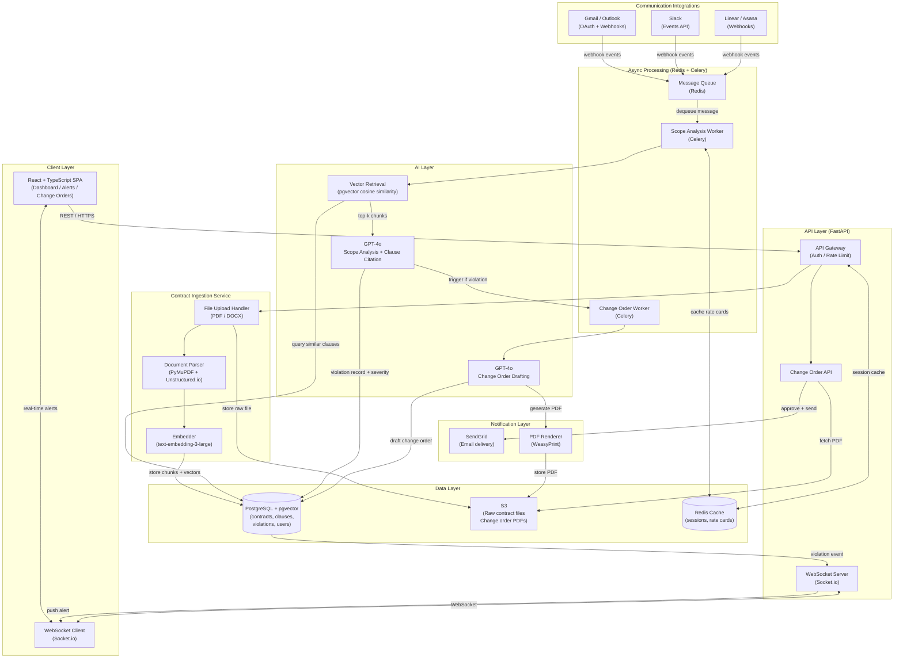

The system is a SaaS web application that ingests signed contracts, monitors communication channels in real time, and uses an LLM pipeline to detect scope creep and auto-generate change orders. The core technology stack is: **Python (FastAPI)** for backend services due to its async performance and rich ML ecosystem; **React + TypeScript** for the frontend because of strong typing and component reuse; **PostgreSQL** with **pgvector** extension as the primary data store, enabling both relational contract metadata and semantic vector search over contract clauses without a separate vector database; **Redis** for job queues (via Celery) and caching; and **OpenAI GPT-4o** as the LLM backbone for contract parsing, message analysis, and change-order drafting, chosen because it offers the best instruction-following and document comprehension at commercially viable latency.

The architecture has five major components: (1) **Ingestion Service** — PDF/DOCX contract parser using PyMuPDF + Unstructured.io that chunks contract text, embeds chunks with `text-embedding-3-large`, and stores them in pgvector; (2) **Integration Hub** — OAuth connectors for Gmail, Outlook, Slack, and Linear that stream incoming client messages via webhooks into a Redis queue; (3) **Scope Analysis Engine** — a Celery worker that retrieves relevant contract chunks via cosine similarity, then calls GPT-4o with a structured prompt comparing the message against scope boundaries, returning a violation score, specific clause citations, and a severity label; (4) **Change Order Generator** — a secondary LLM call that drafts a professional change-order document using the freelancer's stored rate card and the detected out-of-scope work; (5) **Notification + Dashboard** — a React SPA that displays real-time alerts via WebSockets (Socket.io), lets users review/approve/send change orders, and shows a monthly "recovered revenue" metric.

Data flows: raw message → Redis queue → Scope Analysis Engine (vector retrieval + LLM) → violation record in Postgres → WebSocket push to dashboard → user approves change order → PDF rendered and sent via SendGrid. Deployment targets AWS on ECS Fargate (containerized services) with RDS Postgres, ElastiCache Redis, and S3 for contract storage, keeping infrastructure serverless-adjacent and cost-proportional to usage. Human-assisted requirements include: OpenAI API key + billing, OAuth app credentials for each communication platform (Google, Microsoft, Slack), SendGrid account for email delivery, and Stripe integration for SaaS billing.

## Architecture Diagram

