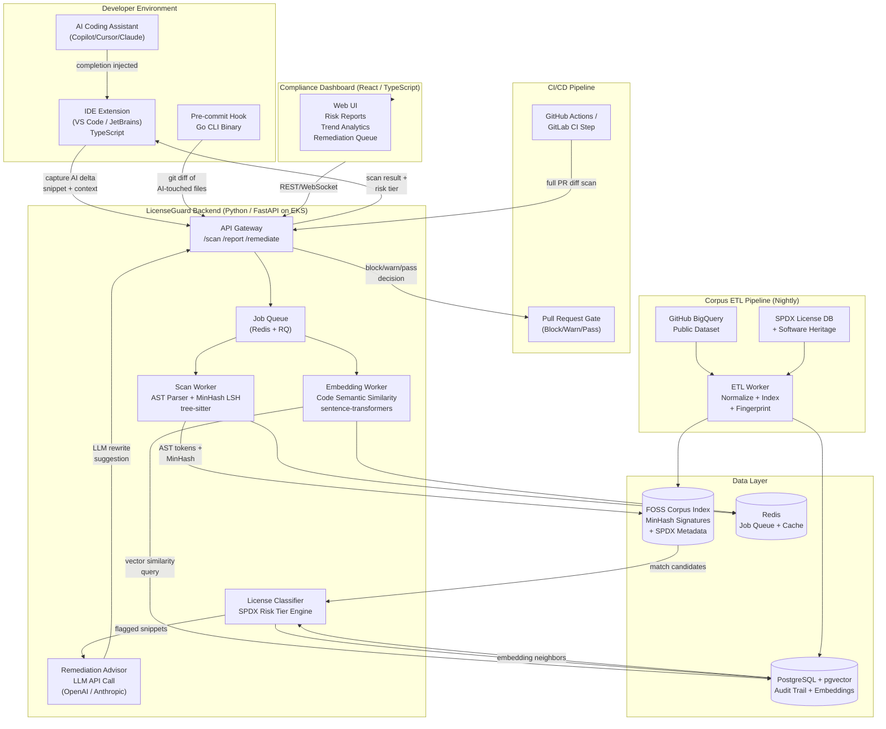

The solution is a developer-native license contamination detection platform called **LicenseGuard**, built as a polyglot system that intercepts AI-generated code at multiple pipeline stages: IDE extension, pre-commit hook, and CI/CD gate. The core detection engine runs as a self-hosted or SaaS microservice backend, chosen to allow resource-intensive similarity analysis without blocking the developer's local machine.

**Technology choices:** The backend is Python (FastAPI) because the ML/NLP ecosystem for code similarity — tree-sitter AST parsing, MinHash/LSH fingerprinting, sentence-transformers for semantic embeddings — is most mature in Python. PostgreSQL with pgvector stores code snippet embeddings and audit trails. Redis handles job queuing (via RQ) for async scan jobs. A lightweight Go CLI binary handles pre-commit hooks because Go produces single-binary, zero-dependency executables ideal for developer machines. VS Code and JetBrains extensions (TypeScript) intercept AI assistant completions via the editor's completion API, capturing the delta between ambient code and AI suggestions. A React/TypeScript dashboard serves compliance officers with trend data, risk reports, and remediation workflows.

**Detection pipeline:** Code snippets are parsed into AST-normalized tokens, then compared against a continuously-updated FOSS corpus index (sourced from SPDX, Software Heritage, and Google BigQuery public GitHub dataset) using MinHash LSH for near-duplicate detection and cosine similarity on embeddings for semantic clones. License classification uses SPDX identifiers with a risk-tier taxonomy (copyleft/permissive/proprietary). A remediation advisor (LLM call via OpenAI/Anthropic API) suggests license-compatible rewrites for flagged snippets.

**Deployment:** Kubernetes on AWS EKS for the backend, with an optional air-gapped Docker Compose mode for enterprises with strict data policies. The corpus index is pre-built and updated nightly via a separate ETL pipeline.

**Human-assistance requirements:** OpenAI/Anthropic API keys for remediation suggestions; AWS account; initial corpus licensing rights verification with a lawyer; GitHub App registration for CI/CD integration.

## Architecture Diagram

