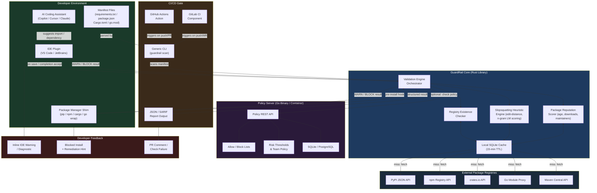

The solution is **GuardRail** — a multi-layer, open-source supply-chain interception platform that validates AI-generated package dependencies at three enforcement points: IDE (real-time, pre-acceptance), package-manager proxy (pre-install), and CI/CD gate (pre-merge). The architecture is deliberately polyglot-hostile: a single Rust core library handles all validation logic for performance and memory safety, surfaced through thin language-specific bindings (Python, Node.js, VS Code Extension API). Rust is chosen because package-manager hooks run synchronously in hot paths where latency is felt immediately, and supply-chain tooling itself must be trustworthy.

The central **Validation Engine** runs three checks in parallel: (1) Registry Existence — live HTTP calls to PyPI JSON API, npm registry, crates.io, Go module proxy, Maven Central; (2) Typosquatting/Slopsquatting Heuristics — edit-distance, phonetic similarity, and n-gram language model scoring against known-good package corpuses to flag names with AI-generation fingerprints; (3) Package Reputation — download counts, publish date, maintainer count, and GitHub stars fetched via registry metadata. A local SQLite cache (with 15-minute TTL) prevents redundant API calls during rapid edit cycles.

The **IDE Plugin** (VS Code / JetBrains) hooks into document save and AI completion acceptance events, calling the Rust engine via Node.js N-API or JVM JNI bindings, surfacing inline diagnostics before the developer moves on. The **Package Manager Proxy** wraps pip, npm, cargo, and go with shim scripts that invoke the engine pre-install, blocking on policy violations. The **CI/CD Gate** ships as a GitHub Actions action, GitLab CI component, and generic CLI — scanning manifest files (requirements.txt, package.json, Cargo.toml, go.mod) against the engine with a structured JSON report and configurable fail policy.

A lightweight **Policy Server** (Go HTTP service, deployable as a single binary or container) lets enterprise teams centralize allow-lists, block-lists, and risk thresholds, with SQLite for small teams and PostgreSQL for enterprises. All components phone home to the policy server only when explicitly configured; fully air-gapped operation is supported.

Human assistance is required for: npm/PyPI API keys for higher rate limits, GitHub App credentials for PR decoration, and optional LLM scoring API keys (for name-pattern analysis) if teams want the cloud-enhanced tier.

## Architecture Diagram

