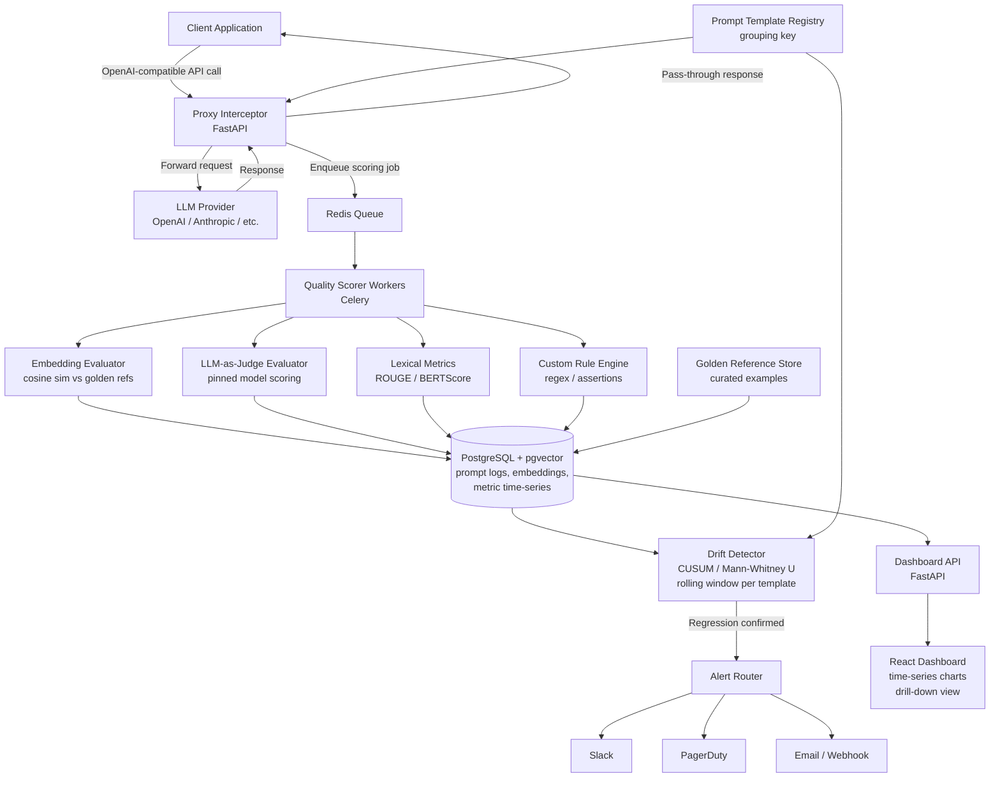

The system is a continuous quality-monitoring platform for LLM-powered applications, intercepting production inference calls and statistically detecting silent regressions in output quality before users notice. The core insight is treating LLM output quality like a statistical process control problem: establish baselines during known-good periods, then run ongoing hypothesis testing to detect distributional shifts.

The stack is Python throughout. FastAPI serves the proxy/ingestion layer because it handles async I/O naturally and matches the OpenAI-compatible REST interface, making SDK-level integration a one-line change for teams. PostgreSQL with pgvector stores prompt logs, embeddings, and metric time-series — a single datastore reduces operational surface area and pgvector enables semantic similarity comparisons without a separate vector DB. Celery with Redis handles async scoring jobs; quality evaluation is latency-sensitive to decouple from the hot path. React + Recharts powers the dashboard for real-time visualization of metric trends and alerts.

**Major components:** (1) Proxy Interceptor — thin OpenAI-compatible reverse proxy that forwards requests, captures request/response pairs, and enqueues scoring jobs asynchronously with sub-5ms overhead. (2) Quality Scorer — Celery workers running a configurable suite of evaluators: embedding cosine similarity against golden references, LLM-as-judge scoring using a pinned evaluator model, lexical metrics (ROUGE, BERTScore), and custom regex/assertion rules. (3) Drift Detector — applies CUSUM and Mann-Whitney U tests over rolling windows of metric streams per prompt-template group. (4) Alert Router — sends Slack/PagerDuty/email notifications with evidence packets when drift is confirmed. (5) Dashboard — time-series charts with drill-down to individual regressed outputs.

Deployment targets a single Docker Compose stack for small teams or Kubernetes with horizontal Celery worker scaling for high-volume production. Known constraints: LLM-as-judge calls require an API key (OpenAI or Anthropic) and add cost; teams must inject golden reference outputs during onboarding or accept unsupervised-only scoring initially. Human assistance needed for: provider API key provisioning, alert destination credentials, and initial golden-set curation.

## Architecture Diagram

