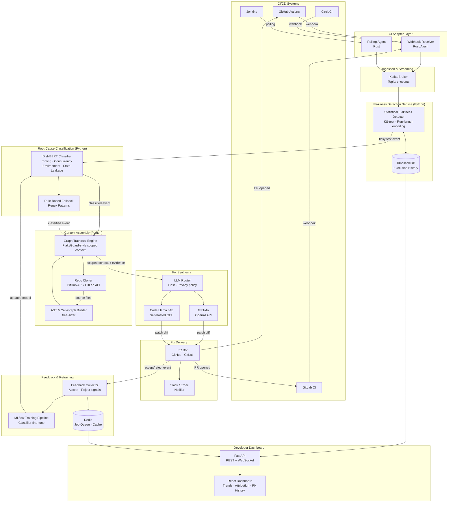

The system is a cross-repository, CI-agnostic platform that ingests test execution telemetry, classifies flakiness root causes, and proposes code-level fixes — operating as a background service that augments existing pipelines without replacing them. The architecture is event-driven and polyglot: a lightweight Rust-based ingestion layer handles high-throughput log streaming without GC pauses; Python handles ML classification and LLM orchestration where ecosystem richness matters; TypeScript powers the developer-facing dashboard. PostgreSQL with TimescaleDB extension stores time-series execution data efficiently without a separate TSDB. Redis handles job queuing and short-lived caching. This combination avoids over-engineering while matching each component's performance profile to its workload.

**Major components:** (1) CI Adapters — thin webhook receivers and polling agents for GitHub Actions, GitLab CI, Jenkins, and CircleCI that normalize execution payloads into a canonical schema. (2) Ingestion Service (Rust/Axum) — validates, deduplicates, and streams events into Kafka topics. (3) Flakiness Detector — a Python service consuming Kafka that applies statistical tests (Kolmogorov-Smirnov on pass/fail distributions, run-length encoding for intermittency patterns) to classify tests as flaky with confidence scores. (4) Root-Cause Classifier — a fine-tuned distilbert model trained on labeled failure logs categorizing failures into timing, concurrency, environment, or state-leakage buckets, with a rule-based fallback for high-confidence regex patterns. (5) Context Assembler — implements the FlakyGuard-inspired graph traversal strategy on repository ASTs, extracting precisely scoped context (call graph neighbors, shared fixtures, thread entry points) per root-cause category to avoid the LLM context-bloat problem. (6) Fix Synthesizer — sends assembled context plus failure evidence to GPT-4o or a self-hosted Code Llama 34B fallback, generating patch diffs. (7) PR Bot — opens GitHub/GitLab pull requests with fix proposals, test re-run evidence, and confidence ratings. (8) API + Dashboard (FastAPI + React) — surfaces per-repo flakiness trends, attribution breakdowns, fix history, and acceptance rates. (9) Feedback Loop — developer accept/reject signals on PRs retrain the classifier and tune context-assembly heuristics via a lightweight MLflow-tracked fine-tuning pipeline.

**Data flow:** CI event → CI Adapter → Kafka → Flakiness Detector (flags flaky tests) → Root-Cause Classifier → Context Assembler (fetches repo source via GitHub API / local clone) → Fix Synthesizer (LLM call) → PR Bot → Developer feedback → retraining pipeline.

**Deployment target:** Kubernetes on any cloud (GKE/EKS/AKS) or self-hosted, with Helm charts. Sensitive enterprise repos can run the entire stack on-premises with Code Llama replacing OpenAI. Kafka can be replaced with Redis Streams for small deployments.

**Human-assisted requirements:** OpenAI API key (or GPU hardware for Code Llama), GitHub/GitLab OAuth app credentials, initial labeled dataset of flaky test failures for classifier training (can be bootstrapped from public datasets + synthetic augmentation), and enterprise SSO integration.

## Architecture Diagram

