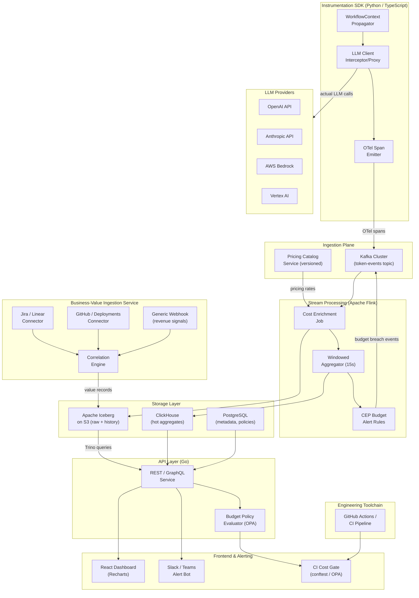

The system is a purpose-built **AI Token Cost Attribution Platform** (ATCAP) that intercepts LLM API calls, enriches them with business context, stores cost and usage telemetry at scale, and correlates spend against business-value signals through real-time dashboards and alerting. The core insight is that attribution must happen at call time — retroactive tagging from invoices is too late and too lossy.

**Technology stack rationale:** The instrumentation layer is a thin **OpenTelemetry-compatible SDK** (Python and TypeScript packages) that wraps LLM client libraries (OpenAI, Anthropic, Bedrock, Vertex) using monkey-patching and proxy patterns. OTel is chosen because engineering teams already pipe traces through it, making adoption nearly zero-friction. Each span is enriched with a `WorkflowContext` propagated via thread-local / AsyncContext, carrying feature name, team, agent run ID, and a business-entity ID (ticket, PR, pipeline). The SDK emits structured events to a **Kafka** cluster (high-throughput, durable, replayable), which is essential given the "trillions of rows per month" problem scale.

A **Flink** streaming job performs real-time cost computation (token counts × per-model pricing from a versioned pricing catalog), enrichment from a feature registry, and 15-second windowed rollups before writing to **Apache Iceberg** tables on S3 via a **Trino** query layer. Iceberg gives full ACID correctness, time-travel for budget-period comparisons, and efficient partition pruning at petabyte scale. Hot-path aggregates land in **ClickHouse** for sub-second dashboard queries.

**Business-value ingestion** is a separate microservice that pulls from Jira/Linear (tickets closed), GitHub (PRs merged, deployments), and a generic webhook for revenue pipeline signals. A lightweight correlation engine joins cost windows to value windows using configurable lag tolerances, producing ROI unit-economics records.

The **API layer** is a Go service (low latency, strong concurrency) exposing REST and GraphQL endpoints consumed by a **React + Recharts** dashboard and a Slack/Teams alerting bot. Budget policies (team-level, feature-level, model-level spend thresholds) are evaluated in Flink CEP rules and trigger alerts before overruns occur. A **conftest/OPA policy engine** enforces cost gates in CI pipelines.

**Deployment:** Kubernetes on any cloud; Helm chart for self-hosted enterprise, plus a SaaS control plane option. The pricing catalog microservice will require ongoing maintenance as providers change rates — this is a human-assisted operational concern. LLM provider API keys for cost estimation validation and OAuth tokens for Jira/GitHub integrations require customer provisioning. GPU-side cost attribution (for self-hosted models) requires integration with DCGM metrics — hardware-dependent and likely needing professional services engagement.

## Architecture Diagram

