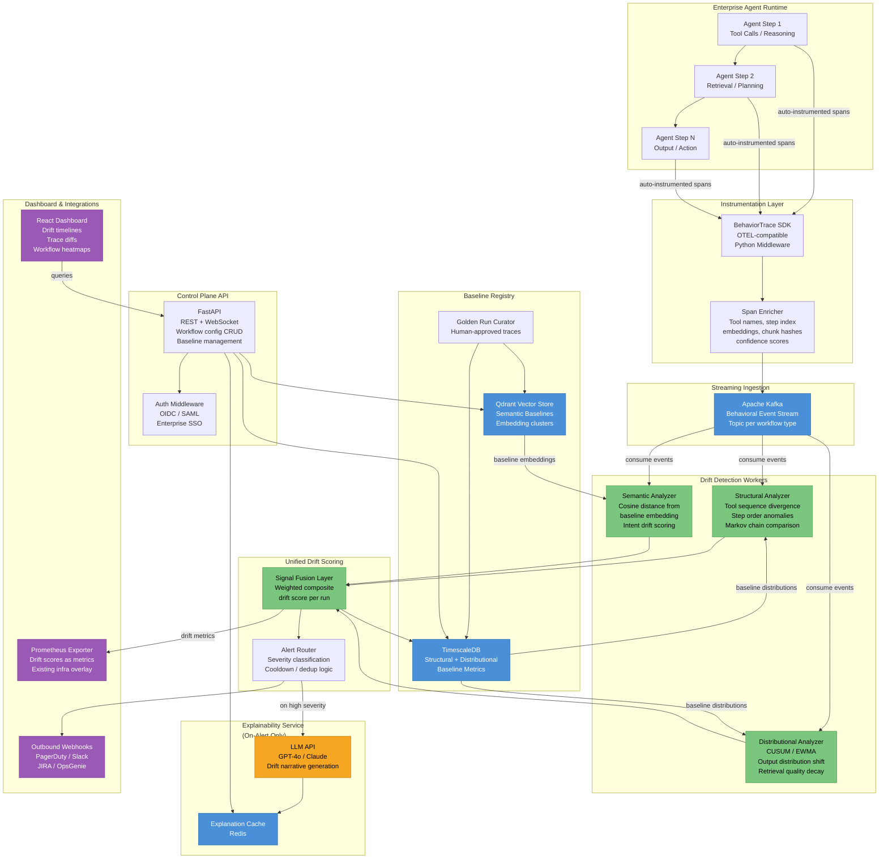

The solution is a behavioral telemetry and drift detection platform, deployed as a lightweight sidecar-plus-control-plane architecture that sits alongside existing agentic workflows without requiring agents to be rebuilt. The core insight is that behavioral drift must be detected across three distinct signal layers: **structural** (tool selection sequences, step ordering), **semantic** (embedding-space distance between intended and actual reasoning), and **distributional** (output token distributions, confidence signals, retrieval quality scores). Combining these three layers into a unified drift score is what separates this from both infrastructure monitoring and naive LLM-as-judge approaches.

**Technology choices:** The instrumentation SDK is Python (the dominant language for agentic frameworks like LangChain, LlamaIndex, CrewAI, AutoGen), exposing OpenTelemetry-compatible spans enriched with behavioral attributes — tool names, step indices, retrieved chunk hashes, reasoning chain embeddings. This plugs into existing OTEL collectors so infrastructure teams have zero new ingestion pipelines to operate. The streaming pipeline uses Apache Kafka because agent traces arrive as event streams with variable cardinality, and Kafka's log compaction enables replay for retrospective baselining. The analytical backend is TimescaleDB (PostgreSQL extension) for time-series drift metrics with SQL familiarity, plus Qdrant as a vector store for embedding-based semantic baseline comparisons. Drift detection algorithms run in Python workers using statistical process control (CUSUM, EWMA) for distributional signals and cosine distance decay for semantic signals — no LLM-in-the-loop needed for core detection, keeping latency and cost low. An optional LLM-powered explainability layer (calling GPT-4o or Claude via API) generates human-readable drift summaries only on alert, gating cost behind actual signal. The control plane API is FastAPI; the dashboard is React with Recharts. Deployment target is Kubernetes with Helm charts, designed for enterprise on-premise or VPC deployment given data sensitivity.

**Known constraints:** Semantic baselining requires a corpus of "golden run" traces — human assistance needed to curate initial baselines per workflow. LLM explainability requires an API key for a frontier model. Highly customized agent frameworks may need bespoke SDK adapters.

## Architecture Diagram

